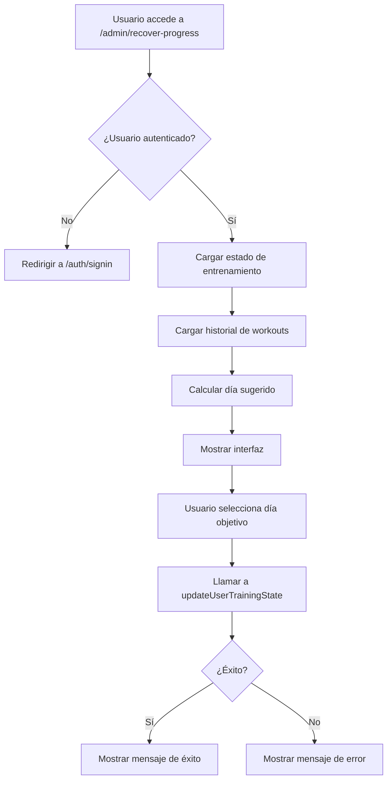

# 🔧 Herramienta de Recuperación de Progreso - Documentación Técnica

## Descripción General

La herramienta de recuperación de progreso es una página administrativa que permite a los usuarios restaurar su estado de entrenamiento (`currentDay`) en caso de pérdida de datos o problemas de sincronización entre IndexedDB local y Firestore.

## Ubicación

- **Ruta del archivo**: `src/app/admin/recover-progress/page.tsx`
- **URL de acceso**: `/admin/recover-progress`
- **Tipo**: Client Component (Next.js)

## Arquitectura

### Dependencias

```typescript
import { useState, useEffect } from 'react';
import { useAuth } from '@/context/AuthContext';
import {
  subscribeToUserTrainingState,
  updateUserTrainingState,
  UserTrainingState,
  subscribeToWorkoutLogs,
  WorkoutLog
} from '@/services/db';
import { useRouter } from 'next/navigation';
```

### Estado Local

```typescript
const [trainingState, setTrainingState] = useState<UserTrainingState | null>(null);
const [workouts, setWorkouts] = useState<WorkoutLog[]>([]);
const [targetDay, setTargetDay] = useState<number>(6);
const [updating, setUpdating] = useState(false);
const [message, setMessage] = useState<{ type: 'success' | 'error' | 'info', text: string } | null>(null);
```

## Flujo de Datos



## Funciones Principales

### 1. Autenticación y Redirección

```typescript
useEffect(() => {
  if (!loading && !user) {
    router.push('/auth/signin');
    return;
  }
  // ...
}, [user, loading, router]);
```

**Propósito**: Garantizar que solo usuarios autenticados puedan acceder a la herramienta.

### 2. Suscripción a Datos en Tiempo Real

```typescript
const unsubscribeState = subscribeToUserTrainingState(user.uid, (state) => {
  setTrainingState(state);
});

const unsubscribeWorkouts = subscribeToWorkoutLogs(user.uid, (logs) => {
  setWorkouts(logs);
});
```

**Propósito**: Mantener la UI sincronizada con Firestore en tiempo real.

### 3. Cálculo del Día Sugerido

```typescript
const getMaxDayFromWorkouts = () => {
  if (workouts.length === 0) return 1;

  const maxDay = Math.max(...workouts
    .filter(w => w.protocolDay)
    .map(w => w.protocolDay || 0));

  return maxDay > 0 ? maxDay : 1;
};
```

**Propósito**: Analizar el historial de workouts y sugerir el próximo día lógico basándose en el último entrenamiento completado.

### 4. Función de Recuperación

```typescript
const handleRecover = async () => {
  if (!user || !targetDay) return;

  setUpdating(true);
  setMessage(null);

  try {
    await updateUserTrainingState(user.uid, {
      currentDay: targetDay
    });

    setMessage({
      type: 'success',
      text: `✅ ¡Progreso restaurado exitosamente! Día actualizado a ${targetDay}`
    });
  } catch (error) {
    console.error('Error actualizando progreso:', error);
    setMessage({
      type: 'error',
      text: '❌ Error al actualizar el progreso. Por favor intenta de nuevo.'
    });
  } finally {
    setUpdating(false);
  }
};
```

**Propósito**: Actualizar el campo `currentDay` en Firestore para el usuario autenticado.

## Estructura de Datos

### UserTrainingState

```typescript
interface UserTrainingState {
  currentDay: number;                    // Día actual del protocolo (1-180)
  completedProtocolSessions: number;     // Sesiones completadas
  liftState: {
    bench: number;                       // Training Max para bench press
    squat: number;                       // Training Max para squat
    deadlift: number;                    // Training Max para deadlift
    ohp: number;                         // Training Max para overhead press
    pullupsLevel: number;                // Nivel de pull-ups (1-12)
  };
  planVersion: string;                   // ID de la variante del plan
  protocolCompleted: boolean;            // Si completó el protocolo de 180 días
}
```

### WorkoutLog

```typescript
interface WorkoutLog {
  id: string;
  userId: string;
  routineId: string;
  routineName: string;
  date: string;
  exercises: ExerciseLog[];
  finisherCompleted: boolean;
  timestamp: Date;
  protocolDay?: number;                  // Día del protocolo (usado para sugerencia)
  protocolDayType?: string;
  cycleIndex?: number;
  isDeload?: boolean;
}
```

## Seguridad

### Niveles de Protección

1. **Autenticación Firebase**: Solo usuarios autenticados pueden acceder
2. **Firestore Rules**: Las reglas de Firestore validan que `request.auth.uid == userId`
3. **Obscuridad por URL**: No hay enlaces visibles a esta página en la app
4. **Validación Client-side**: Previene inputs inválidos (día < 1 o > 180)

### Reglas de Firestore Aplicables

```javascript
match /userTrainingState/{userId} {
  allow read, write: if request.auth != null && request.auth.uid == userId;
}
```

**Nota**: Esto garantiza que un usuario solo puede leer/modificar su propio estado de entrenamiento.

## Casos de Uso

### Caso 1: Pérdida de Sincronización
**Problema**: El usuario completó entrenamientos pero `currentDay` se reseteo a 1.
**Solución**: La herramienta analiza el historial de `workouts` y sugiere el día correcto.

### Caso 2: Error Manual del Usuario
**Problema**: El usuario accidentalmente marcó un día incorrecto.
**Solución**: Permite ajustar manualmente a cualquier día entre 1-180.

### Caso 3: Migración de Datos
**Problema**: Datos importados desde otro sistema sin `currentDay` correcto.
**Solución**: Restauración manual con validación visual del estado actual.

## Mejoras Futuras

### Sugerencias de Implementación

1. **Auditoría de Cambios**
   ```typescript
   interface RecoveryLog {
     userId: string;
     previousDay: number;
     newDay: number;
     timestamp: Date;
     reason?: string;
   }
   ```

2. **Límite de Uso**
   - Limitar a 3 usos por semana para prevenir abuso
   - Agregar cooldown entre usos

3. **Validación Avanzada**
   ```typescript
   const validateDayChange = (current: number, target: number): boolean => {
     const maxJump = 7; // No permitir saltos mayores a 7 días
     return Math.abs(target - current) <= maxJump;
   };
   ```

4. **Backup Automático**
   - Guardar estado previo antes de actualizar
   - Permitir deshacer el último cambio

## Testing

### Test Cases Recomendados

```typescript
describe('RecoverProgressPage', () => {
  it('should redirect unauthenticated users', () => {
    // Test redirección
  });

  it('should calculate suggested day from workout history', () => {
    const workouts = [
      { protocolDay: 3 },
      { protocolDay: 5 },
      { protocolDay: 4 }
    ];
    expect(getMaxDayFromWorkouts(workouts)).toBe(6); // Max + 1
  });

  it('should update currentDay in Firestore', async () => {
    // Test actualización
  });

  it('should show error message on failure', async () => {
    // Test manejo de errores
  });
});
```

## Troubleshooting

### Problema: "Error al actualizar el progreso"

**Posibles Causas**:
1. Reglas de Firestore bloqueando la escritura
2. Usuario no autenticado correctamente
3. Problema de conexión a internet
4. Formato inválido de datos

**Solución**:
```typescript
// Verificar en la consola del navegador:
console.log('User authenticated:', auth.currentUser);
console.log('User ID:', user?.uid);
console.log('Target day:', targetDay);
```

### Problema: Página no carga datos

**Verificar**:
1. Usuario autenticado: `console.log(user)`
2. Suscripciones activas: `console.log('Subscriptions initialized')`
3. Reglas de Firestore correctas

## Mantenimiento

### Logs Importantes

```typescript
// En producción, considerar agregar:
import { logEvent } from '@/services/analytics';

const handleRecover = async () => {
  // ... código existente

  logEvent('progress_recovered', {
    userId: user.uid,
    previousDay: trainingState?.currentDay,
    newDay: targetDay,
    timestamp: new Date()
  });
};
```

### Monitoreo

Métricas a trackear:
- Número de recuperaciones por usuario
- Diferencia entre día anterior y nuevo día
- Frecuencia de uso por usuario
- Tasa de éxito/error

## Referencias

- [Firestore Security Rules](https://firebase.google.com/docs/firestore/security/get-started)
- [Next.js Client Components](https://nextjs.org/docs/app/building-your-application/rendering/client-components)
- [React Hooks Best Practices](https://react.dev/reference/react)

---

**Última actualización**: 2026-02-26
**Autor**: Sistema GymCounter
**Versión**: 1.0.0
